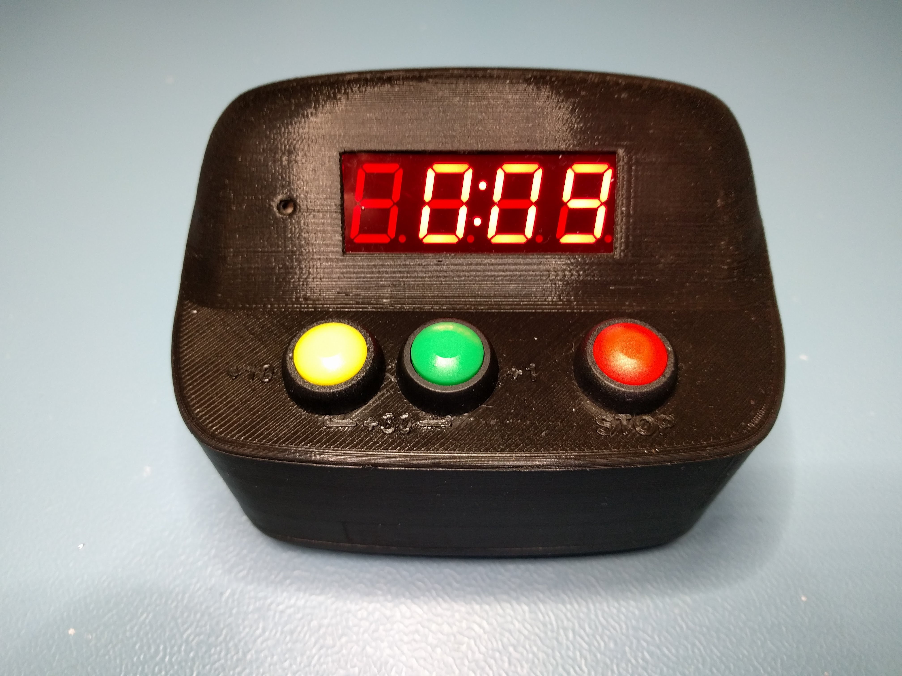

# Arcade Kitchen Timer

The Arcade Kitchen Timer Mini is my first attempt at designing and developing a product using electronics, programming and 3D modelling. See [Wiki](https://github.com/joaroyen/arcade-kitchen-timer/wiki) for details about the project.

> PS: Don't expect much activity in this repository after it is published.